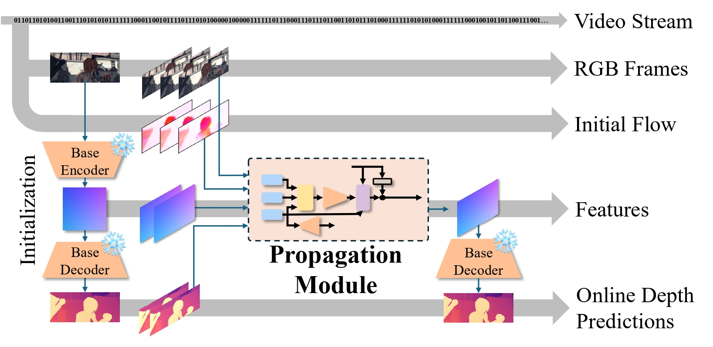
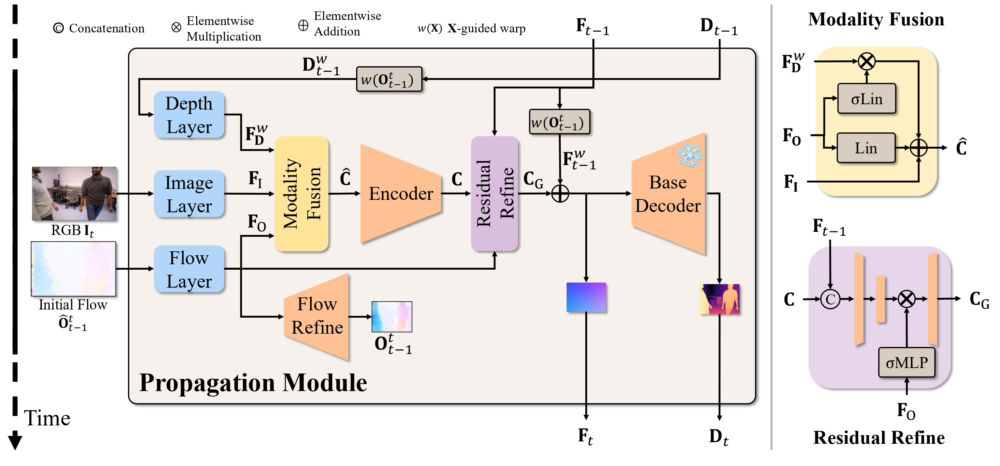
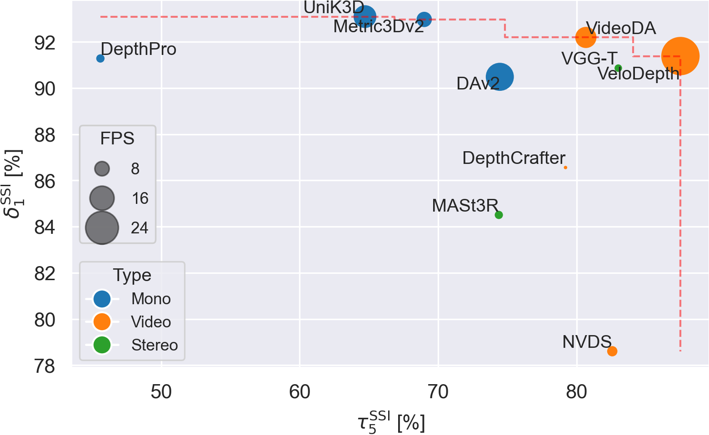

<div align="center">

# Video Depth Propagation

<a href="https://arxiv.org/abs/2512.10725"></a>
<a href='https://lpiccinelli-eth.github.io/pub/velodepth'></a>

</div>

<div>
  
</div>

<br>
<br>

<div>
  
</div>


> [**Video Depth Propagation**](https://lpiccinelli-eth.github.io/pub/velodepth),
> Luigi Piccinelli, Thiemo Wandel, Christos Sakaridis, Wim Abbeloos, Luc Van Gool,
> 3DV 2026,
> *Paper at [arXiv 2512.10725](https://arxiv.org/abs/2512.10725)*


## News and ToDo

- [] Releasing training code.
- [] Releasing evaluation datasets.
- [x] `14.12.2025`: Model and code released.
- [x] `04.11.2025`: VeloDepth is accepted at 3DV 2026!


## Visualization

<video autoplay loop muted playsinline width="100%">
  <source src="assets/docs/viz.mp4" type="video/mp4">
</video>


***Check more results in our [website](https://lpiccinelli-eth.github.io/pub/velodepth/)!***


## Installation

Requirements are not hard requirements, but there might be some differences (not tested):
- Linux
- Python 3.11+ 
- CUDA 12.1+

Install the environment needed to run UniK3D with:
```shell
export VENV_DIR=<YOUR-VENVS-DIR>
export NAME=velodepth

python -m venv $VENV_DIR/$NAME
source $VENV_DIR/$NAME/bin/activate

# Install VeloDepth and dependencies (more recent CUDAs work fine)
pip install -e . --extra-index-url https://download.pytorch.org/whl/cu121

# Install Pillow-SIMD (Optional)
pip uninstall pillow
CC="cc -mavx2" pip install -U --force-reinstall pillow-simd

# Install KNN (for evaluation only)
cd ./velodepth/ops/knn;bash compile.sh;cd ../../../
```

If you use conda, you should change the following: 
```shell
python -m venv $VENV_DIR/$NAME -> conda create -n $NAME python=3.11
source $VENV_DIR/$NAME/bin/activate -> conda activate $NAME
```

Run VeloDepth on the given assets to test your installation (you can check this script as guideline for further usage):
```shell
python ./scripts/demo.py --video bears.mp4 --out_dir ./data
```
If everything runs correctly, `demo.py` will save RGBs, Depth maps for each frame of the video `bears.mp4`


## Get Started

After installing the dependencies, you can load the pre-trained models easily from [Hugging Face](https://huggingface.co/lpiccinelli) as follows:

```python
from velodepth.models import VeloDepth

model = VeloDepth.from_pretrained("lpiccinelli/velodepth")
```

Then you can generate the metric 3D estimation and rays prediction directly from a single RGB image only as follows:

```python
import numpy as np
from PIL import Image

# Move to CUDA, if any
device = torch.device("cuda" if torch.cuda.is_available() else "cpu")
model = model.to(device)

# Load the RGB image and the normalization will be taken care of by the model
video_path = "./assets/demo/bears.mp4"

cap = cv2.VideoCapture(video_path)

frames = []
idx = 0
while True:
  ok, frame_bgr = cap.read()
  if not ok:
    break
  if idx % stride == 0:
    frame_rgb = cv2.cvtColor(frame_bgr, cv2.COLOR_BGR2RGB)
    frames.append(frame_rgb)
    if max_frames is not None and len(frames) >= max_frames:
      break
  idx += 1 

cap.release()
rgbs = torch.from_numpy(np.stack(frames, axis=0)).astype(np.uint8)

predictions = model.infer(rgb, normalize=True)

# Point Cloud in Camera Coordinate
xyz = predictions["points"]

# Unprojected rays
rays = predictions["rays"]

# Metric Depth Estimation
depth = predictions["depth"]
```

You can use ground truth camera parameters or rays as input to the model as well:
```python
from velodepth.utils.camera import (Pinhole, OPENCV, Fisheye624, MEI, Spherical)

camera_path = "assets/demo/scannet.json" # any other json file
with open(camera_path, "r") as f:
    camera_dict = json.load(f)

params = torch.tensor(camera_dict["params"])
name = camera_dict["name"]
camera = eval(name)(params=params)
predictions = model.infer(rgb, camera)
```

To use the forward method for your custom training, you should:  
1) Take care of the dataloading:  
  a) ImageNet-normalization  
  b) Long-edge based resizing (and padding) with input shape provided in `image_shape` under configs  
  c) `BxCxHxW` format  
  d) If any intriniscs given, adapt them accordingly to your resizing  
2) Format the input data structure as:  
```python
data = {"image": rgb, "rays": rays}
predictions = model(data, {})
```

## Infer

To run locally, you can use the script `./scripts/infer.py` via the following command:

```bash
python ./scripts/infer.py --input IMAGE_PATH --output OUTPUT_FOLDER --config-file configs/eval/vitl.json --camera-path CAMERA_JSON --save --save-ply
```

```
Usage: python ./scripts/demo.py [OPTIONS]

Options:
  --video PATH             Path to input video OR a folder with frames.
  --frames_from_folder     Interpret --video as a folder of frames.
  --camera_json PATH       Optional camera JSON applied to all frames.
  --out_dir PATH           Optional output directory for RGB/depth/rays and PLY.
  --ply_frame INTEGER      Save a PLY for this frame index.
  --max_frames INTEGER     Limit number of frames.
  --stride INTEGER         Sample every Nth frame.
  --resolution_level INT   Model resolution bucket [0..9].
  --interpolation TEXT     Output upsampling mode (bilinear | bicubic).
```

See also [`./scripts/demo.py`](./scripts/demo.py)


## Model

The available model is the propagatoin of [UniK3D](https://github.com/lpiccinelli-eth/UniK3D), i.e. the base keyframe monodepth model.

Please visit [Hugging Face](https://huggingface.co/lpiccinelli) or click on the links above to access the repo models with weights.
You can load VeloDepth as the following:

```python
from velodepth.models import VeloDepth

model = VeloDepth.from_pretrained(f"lpiccinelli/velodepth")
```

In addition, we provide loading from TorchHub as:

```python

model = torch.hub.load("lpiccinelli-eth/velodepth", "VeloDepth", pretrained=True, trust_repo=True, force_reload=True)
```


## Training

Please visit the [docs/train](docs/train.md) for more information.


## Results

Please visit the [docs/eval](docs/eval.md) for more information about running evaluation.


### Metric 4D Estimation
The metrics is delta_1 for accuracy and tau_5 for pairwise consistency (please check the paper for mathematical details) over metric 4D pointcloud (higher is better) on zero-shot evaluation. 

<div>
  
</div>


## Contributions

If you find any bug in the code, please report to Luigi Piccinelli (lpiccinelli@ethz.ch)


## Citation

If you find our work useful in your research please consider citing our publications:
```bibtex
@inproceedings{piccinelli2025unik3d,
    title     = {Video Depth Propagation},
    author    = {Piccinelli, Luigi and Wandel, Thiemo and  Sakaridis, Christos and Abbeloos, Wim and Van Gool, Luc},
    booktitle = {Proceedings of the International Conference on 3D Vision (3DV)},
    year      = {2026}
}
```

## License

This software is released under Creatives Common BY-NC 4.0 license. You can view a license summary [here](LICENSE).


## Acknowledgement

This work is funded by Toyota Motor Europe via the research project [TRACE-Zurich](https://trace.ethz.ch) (Toyota Research on Automated Cars Europe).
